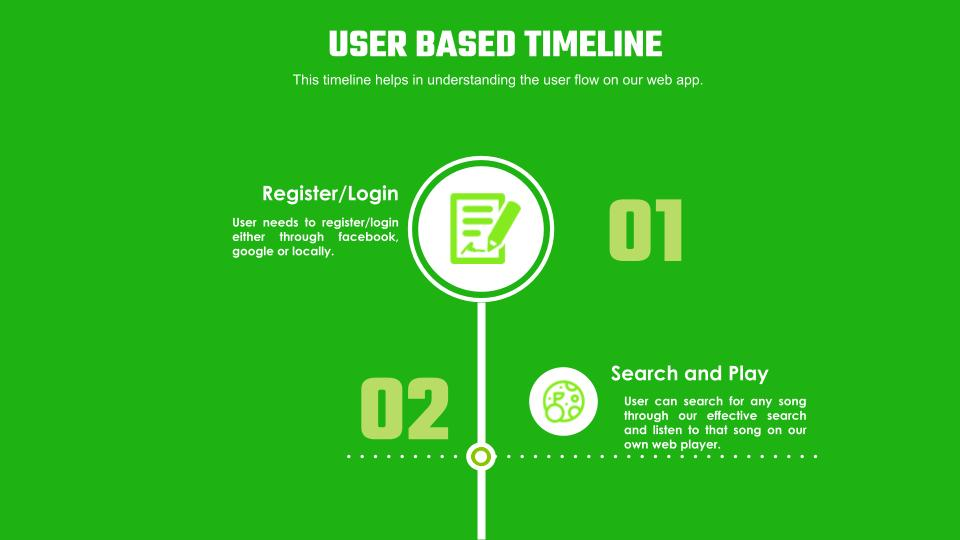

# Audrix (Music Recommendation System)  
#### Problem Statement 
One of the major problems of recommender systems in general, and music recommender systems in particular is the cold start problem, i.e., when a new user registers to the system or a new item is added to the catalog and the system does not have sufficient data associated with these items/users. In such a case, the system cannot properly recommend existing items to a new user (new user problem) or recommend a new item to the existing users

##### Solution
Extract audio metadata features from the audio signals and use content-based learning of the user interest, and user's friends interest in order to effect recommendation.

#### Team Members
[Puneet Kakkar](http://github.com/puneetkakkar91)  
[Puneet Bansal](http://github.com/puneetbansal550)           

### Key features :- 

1. **Stream efficiently based on the network bandwidth**
2. **State-of-the-art streaming player**
3. **Performant search engine for fast searching**
4. **Authentication via social auth/Oauth 2.0**
5. **Rich features for music player** 
6. **Full screen player support** 
7. **Support for hotkeys while playing music** 
7. **Separate recommendation zone with recommendations on the fly using ML algorithms with good accuracy**

### Our Process :-

### User Flow :-

### Platform Screens :-
    
    
  
  
     
